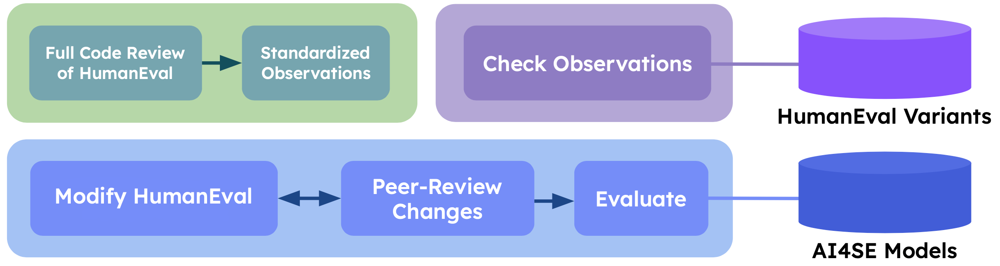
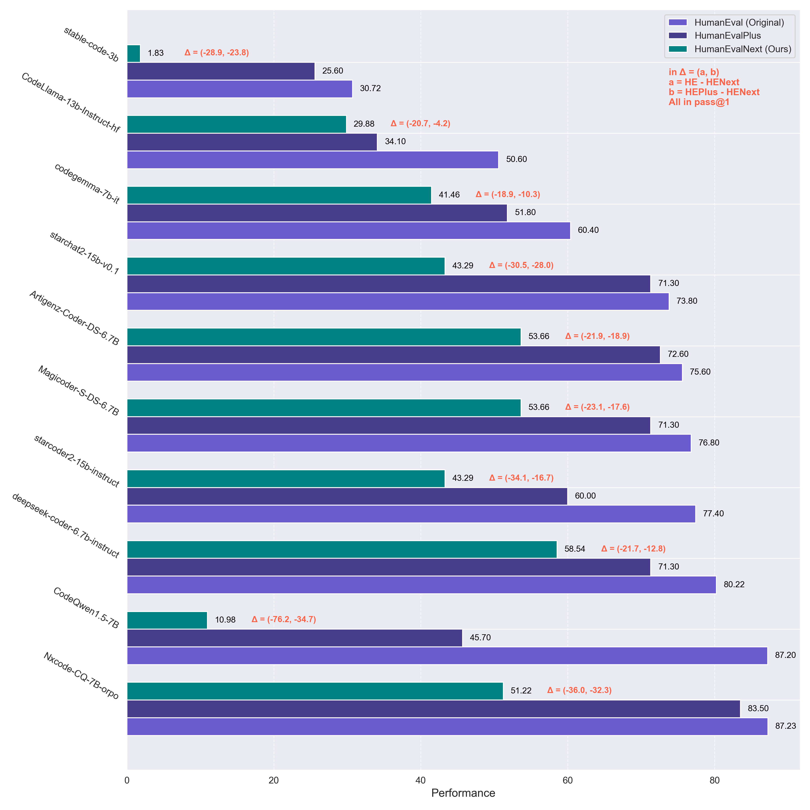

<h1 align="center">Lowering the Barrier in AI4SE Benchmarking: A Comprehensive Review, Search Tool, and Unified Approach for Elevating Benchmark Quality</h1>

## Table of Contents

- [Introduction](#introduction)
- [Review](#review)
- [BenchScout ](#BenchScout )
- [HumanEvalNext](#HumanEvalNext)

## Introduction

The growing use of artificial intelligence (AI) in software engineering (AI4SE) has highlighted the critical need for robust and consistent benchmarking practices. Many of the current benchmarks lack the rigor and standardization needed for precise model evaluation, limiting their effectiveness. Additionally, there is a shortage of comprehensive reviews that could help users navigate and understand existing benchmarks.

To address this challenge, we conducted an extensive survey of 111 AI4SE benchmarks, extracting insights and identifying key limitations in the existing evaluation methods. These findings informed the development of BenchScout , a novel tool designed to assist users in discovering relevant benchmarks and accessing associated literature. In a user study involving 22 practitioners and researchers, BenchScout  was validated for its effectiveness and ease of use.

In addition, we created EvalPro, a framework aimed at enhancing benchmark quality. As a case study, we applied BenchFrame to the widely-used HumanEval code generation benchmark to address its weaknesses. HumanEvalNext, the improved version, includes corrected errors, improved language conversions, increased test coverage, and heightened difficulty.

Our evaluation of ten state-of-the-art code language models on both HumanEval and HumanEvalNext showed a significant 31.22% average reduction in pass@1 scores, illustrating the challenges imposed by more rigorous benchmarks. This result emphasizes the importance of high-quality benchmarks for the development of more robust AI models in software engineering.

The BenchFrame Suite, which includes the survey, tools, and improved benchmarks, is released as an open resource to drive future research in AI4SE and enhance benchmark standards.

## Review

The review section can be found [here](./Review/README.md).

## BenchScout 

BenchScout  is a tool that helps users discover relevant benchmarks and access associated literature. The tool can be found [here](https://evalpro.online/search.html).
The results of the user study on BenchScout  can be found [here](scout/README.md).

## HumanEvalNext - Link to [HuggingFace Dataset 🤗](https://huggingface.co/datasets/AISE-TUDelft/HumanEvalNext)

HumanEvalNext is an improved version of the HumanEval code generation benchmark.
The improvements made are based on the framework EvalPro. This framework is aimed at enhancing benchmark quality through a rigorous improvement process along with peer reviews.
An overview of the approach along with the specific applicability to HumanEval has been illustrated below.

**Figure 1. The Process of improving HumanEval through the BenchFrame framework**

The evaluation results of benchmark can be found [here](https://evalpro.online/leaderboard.html).
A more detailed description of HumanEvalNext can be found [here](./HumanEvalNext/README.md).
We find the following results results when benchmarking 10 SOTA open-weight models.

**Figure 2. Comparison of HumanEval with two enhanced versions. (HumanEvalNext and EvalPlus)**
